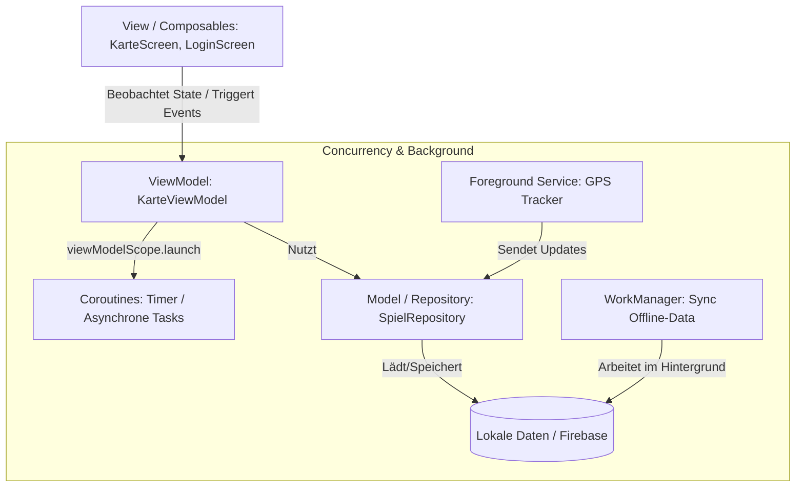

# TeRun – Konzept für Nebenläufigkeit und Background Operations

Dieses Dokument beschreibt das technische Konzept für Nebenläufigkeit (Concurrency) und Hintergrundprozesse der TeRun-App, basierend auf den theoretischen Grundlagen der Vorlesung *Mobile Computing*.

---

## 1. Einführung & Problemstellung

Die TeRun-App ist ein Echtzeit-Multiplayer-Mobility-Spiel. Daraus ergeben sich zwei zentrale technische Anforderungen:
1. **Flüssige UI:** Der UI-Thread (Main Thread) darf unter keinen Umständen blockiert werden (z. B. durch Netzwerkzugriffe auf Firebase oder komplexe Distanzberechnungen), da dies zu Rucklern oder einem **ANR (Android Not Responding)**-Fehler führen würde.
2. **Hintergrundaktivität:** Wenn ein Duell läuft, muss die Position des Spielers via GPS kontinuierlich verfolgt und mit den Spot-Koordinaten abgeglichen werden – selbst wenn das Smartphone in der Tasche steckt (Bildschirm aus) oder der Spieler kurz zu einer anderen App wechselt.

---

## 2. Konzept für Nebenläufigkeit (Concurrency)

Für asynchrone Programmieraufgaben und Nebenläufigkeit innerhalb der App setzen wir voll auf **Kotlin Coroutines** (nicht-blockierende, leichtgewichtige Threads).

### 2.1 Coroutine Scopes & Structured Concurrency
* **`viewModelScope`:** Jedes ViewModel (z. B. `KarteViewModel`) nutzt den integrierten Coroutine-Scope. Startet der Benutzer ein Duell, wird der Countdown-Timer und die Positionsüberwachung im `viewModelScope` gestartet. Wird der Screen verlassen und das ViewModel zerstört, bricht Android alle laufenden Coroutines dieses Scopes automatisch ab (Verhindert Memory Leaks).
  * *Quelle: moco2026-29-jobs.pdf (Structured Concurrency & Job Cancellation)*

### 2.2 Verwendung von Dispatchern
Wir teilen Aufgaben je nach Ressourcenbedarf dem passenden Dispatcher zu:
* **`Dispatchers.Main`:** Für alle UI-Aktualisierungen. Da Jetpack Compose zustandsbasiert arbeitet, werden Statusänderungen (z. B. verbleibende Spielzeit) auf dem Main-Thread geändert, um die Recomposition anzustoßen.
* **`Dispatchers.IO`:** Für E-Mail/Passwort-Authentifizierung mit Firebase Auth und Lese-/Schreiboperationen in der Firebase Firestore-Datenbank.
* **`Dispatchers.Default`:** Für rechenintensive Aufgaben, wie z. B. die Berechnung, ob sich die aktuelle GPS-Koordinate innerhalb des 25m-Radius eines Spots befindet (Haversine-Formel).
  * *Quelle: moco2026-30-dispatcher.pdf (Dispatchers & Thread Pools)*

---

## 3. Konzept für Background Operations (Hintergrundprozesse)

Android unterscheidet streng zwischen verschiedenen Arten von Hintergrundarbeit, je nachdem, wie zeitkritisch und langlebig die Aufgabe ist.

### 3.1 Kontinuierliche Positionsverfolgung: Foreground Service
Da die App im Hintergrund weiterlaufen muss, während ein Duell aktiv ist, reicht eine einfache Coroutine nicht aus, da das Android-Betriebssystem inaktive Apps bei Ressourcenknappheit beendet.
* **Lösung:** Ein **Foreground Service** (Vordergrunddienst).
* **Funktionsweise:** Der Dienst wird gestartet, sobald das Duell beginnt. Er zeigt eine permanente, nicht-entfernbare Benachrichtigung (Notification) in der Statusleiste des Smartphones an. Dies signalisiert dem Betriebssystem eine hohe Priorität, sodass der Dienst nicht beendet wird. Der Dienst empfängt GPS-Updates und gleicht sie mit der Firebase-Datenbank ab.
  * *Quelle: moco2026-25-services.pdf (Foreground Services) & moco2026-26-guide-background-work.pdf (Background Work Classification)*

### 3.2 Garantierte Synchronisation: WorkManager
Für Aufgaben, die nicht sofort ausgeführt werden müssen, aber garantiert abgeschlossen werden sollen, verwenden wir den **WorkManager**.
* **Szenario:** Wenn ein Spieler während eines Duells im Funkloch steht (Offline-Modus), werden seine erreichten Spots lokal in einer SQLite-Datenbank (Room) gespeichert.
* **Lösung:** Wir registrieren einen `OneTimeWorkRequest` im WorkManager mit den Constraints: `NetworkType.CONNECTED` (nur bei bestehender Internetverbindung).
* **Vorteil:** Der WorkManager garantiert die Ausführung der Synchronisation mit Firebase Firestore im Hintergrund, selbst wenn die App geschlossen oder das Smartphone neu gestartet wird.
  * *Quelle: moco2026-27-work-manager.pdf (Garantierte Hintergrundarbeit mit WorkManager)*

---

## 4. Zusammenfassung der Architektur (MVVM)

Die App-Architektur trennt die Zuständigkeiten sauber auf:

* **Model:** Repräsentiert die reinen Daten und die Schnittstelle zu Datenquellen (`SpielDaten.kt`, `SpielRepository.kt`).
* **ViewModel:** Hält den Zustand der UI (`SpielStatus`, `verbleibendeZeit`) als Compose State und verarbeitet Interaktionen. Führt asynchrone Aufgaben über Coroutines aus.
* **View:** Die Jetpack Compose Funktionen zeichnen die UI basierend auf dem Zustand des ViewModels.
